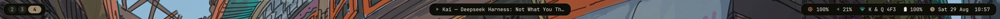
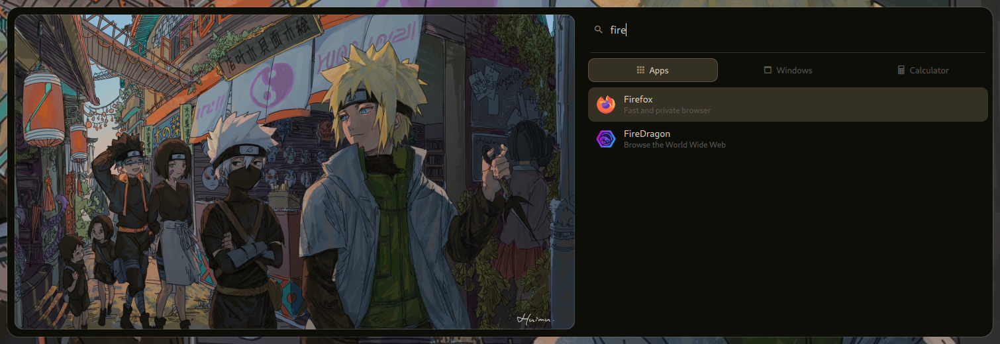
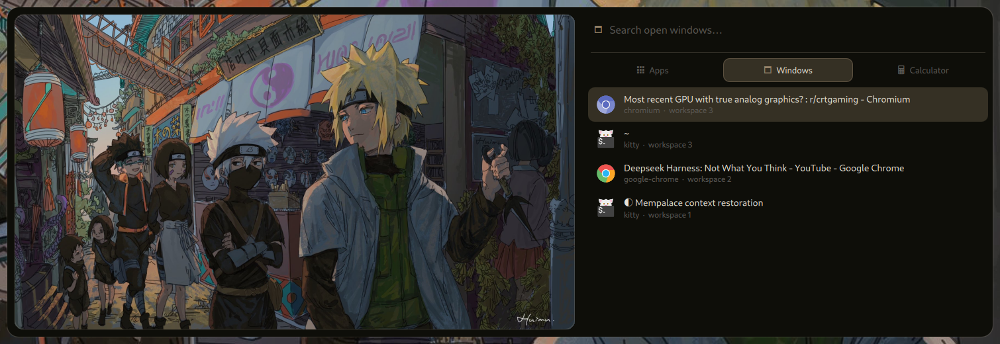
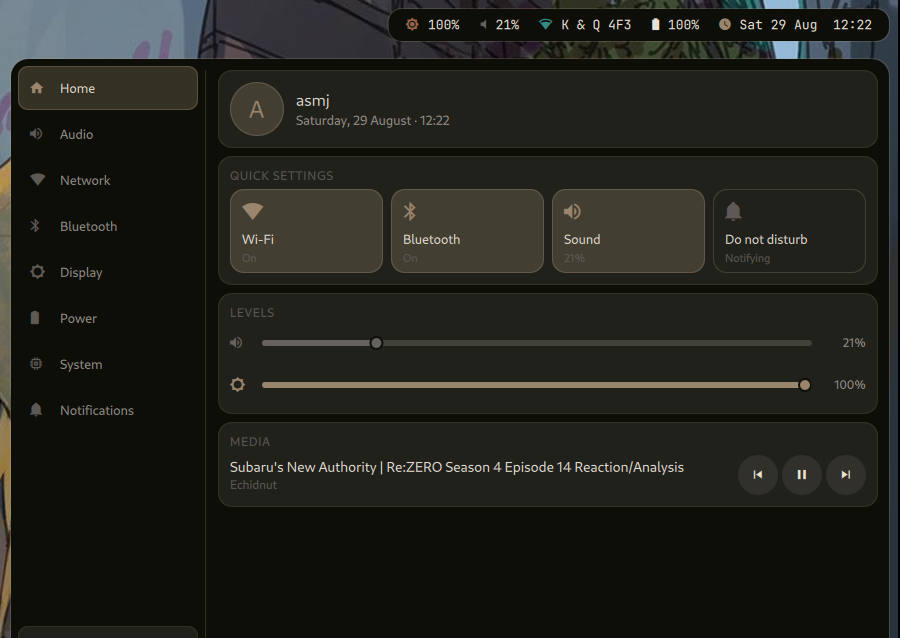
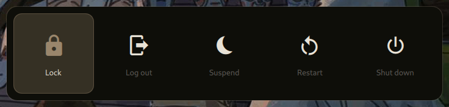
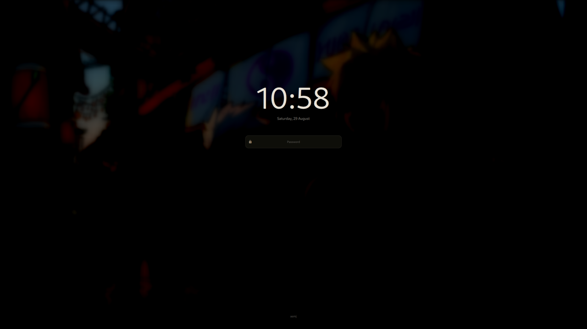

# hypr-quickshell

A Hyprland desktop built on [Quickshell](https://quickshell.org) — bar, launcher,
notifications, lockscreen and power menu as one shell, with everything retinting
from the wallpaper through [pywal](https://github.com/dylanaraps/pywal).

Replaces waybar, rofi, dunst/swaync and swaylock with a single QML surface.

> ### ⚠️ This code is AI-generated
>
> Effectively all of the Quickshell code, the theming scripts and this README
> were written by **Claude (Anthropic)** in a pair-programming session, driven
> by my prompts and reviewed by me on a running machine.
>
> It works on my setup and every feature here was verified on screen, but it
> has not been reviewed line by line by a human, and it has not been tested on
> any hardware but mine. Read it before you run it — especially
> `modules/lock/Lock.qml`, which is a session lock, and `bin/gtk-pywal`, which
> rewrites files under `~/.config` and `~/.themes`.

---

## Screenshots

**Bar** — workspaces · media and window title · tray, backlight, audio, network, battery, clock



**Launcher** — apps, open windows and a calculator in one island, with the current wallpaper beside them




**Control centre** — eight tabs, in the shape noctalia uses



**Power menu** and **lockscreen**




---

## What's in it

| | |
|---|---|
| **Bar** | Island layout, one per monitor. Workspaces, MPRIS media, focused window, system tray, backlight, audio, network, battery, clock. |
| **Launcher** | Three tabs — applications, open windows, calculator — over a fixed-size card showing the current wallpaper. `SUPER+space`. |
| **Notifications** | A real `org.freedesktop.Notifications` daemon and toast stack. Critical notifications never auto-expire. |
| **Lockscreen** | `ext-session-lock` with PAM authentication. Blurred wallpaper, clock, dots. `SUPER+L`. |
| **Power menu** | Lock, log out, suspend, restart, shut down. `SUPER+Q`. |
| **Control centre** | Sidebar of eight tabs — Home, Audio, Network, Bluetooth, Display, Power, System, Notifications. Wi-Fi scans, connects and prompts for a password when one is needed. `SUPER+A`. |
| **GTK/Qt theme** | `bin/gtk-pywal` generates a pywal-coloured GTK theme and a Qt palette, and reaches libadwaita and Flatpak too. |

Everything follows the wallpaper: change it and the shell, the GTK theme, the Qt
palette and the lockscreen all retint without a restart.

## Requirements

```
hyprland  quickshell  python-pywal  qt6ct  imagemagick
brightnessctl  networkmanager  wireplumber  swayidle  awww (or swww)
```

A Nerd Font is required for the bar glyphs — this uses **JetBrainsMono Nerd Font**.

PAM authentication for the lockscreen goes through `/etc/pam.d/swaylock`, which
the `swaylock` package provides. If you do not have it, add a `/etc/pam.d/`
entry containing `auth include login` and point `config` at it in
`modules/lock/Lock.qml`.

## Install

```sh
git clone https://github.com/singhashu23/hypr-quickshell.git
cd hypr-quickshell

# configs — quickshell carries both the hyprland and niri shells
ln -s "$PWD/config/hypr"       ~/.config/hypr
ln -s "$PWD/config/quickshell" ~/.config/quickshell

# scripts
cp bin/* ~/.local/bin/

# wallpapers are expected in ~/Pictures/wall
mkdir -p ~/Pictures/wall && cp wallpapers/wall/* ~/Pictures/wall/

# first palette, then the GTK theme
wal -i ~/Pictures/wall/<some-image>
gtk-pywal
```

Then run `qs -c hyprland`. `hyprland.conf` already starts it.

## Keys

| | |
|---|---|
| `SUPER+space` | launcher |
| `SUPER+W` | launcher, open-windows tab |
| `SUPER+A` | control centre |
| `SUPER+Q` | power menu |
| `SUPER+L` | lock |
| `SUPER+N` | network (`nmtui`) |
| `CTRL+ALT+T` | random wallpaper, retinting everything |

Inside the launcher: `Tab`/`Shift+Tab` or `←`/`→` switch tabs, `↑`/`↓` move,
`Enter` activates. Inside the control centre: `←`/`→` switch tabs, `↑`/`↓`,
`PageUp`/`PageDown` and `Home`/`End` scroll the pane.

Each surface is also reachable over IPC, which is what the keybinds actually call:

```sh
qs -c hyprland ipc call launcher toggle
qs -c hyprland ipc call launcher windows
qs -c hyprland ipc call powermenu toggle
qs -c hyprland ipc call controlcenter toggle
qs -c hyprland ipc call controlcenter tab 2   # straight to a tab
qs -c hyprland ipc call lock lock
qs -c hyprland ipc call lock unlock     # recovery, if a build ever locks you out
```

## Layout

```
config/quickshell/hyprland/
  shell.qml              the surfaces this shell puts on screen
  Theme.qml              every colour and metric, in one place
  services/
    Pywal.qml            watches ~/.cache/wal/colors.json, retints live
    Apps.qml             desktop-entry index and icon resolution
    Compositor.qml       workspaces and windows, over Hyprland and niri alike
    Gtk.qml              mirrors the desktop's GTK settings
  modules/
    bar/ launcher/ lock/ notifications/ powermenu/
    controlcenter/       the panel, its shared parts, and panes/ per tab
  scripts/apps.py        parses .desktop files against the live icon theme
bin/                     wallpaper, theming and session scripts
config/hypr/             Hyprland config
```

## Notes on how a few things work

A handful of these were not obvious, and the reasoning is worth keeping:

**The theme generator does not substitute colours by hex.** Jasper and Orchis
both paint their accent and their `error_color` with the *same* value
(`#F44336`, `#ff5555`), so a hex substitution recolours destructive buttons
along with the accent. Instead, two sibling variants of the same theme are
diffed: a line that differs between them is by construction a line the accent
is on. Destructive actions stay red.

**A "neutral" is low saturation, not `R=G=B`.** Jasper's greys are literally
equal-channel; Orchis-Dracula's are blue-tinted (`#1c1e26` is 28/30/38). Testing
for equal channels silently passes an entire neutral ramp through unrecoloured.

**libadwaita reads no theme at all.** `gtk-theme-name` does nothing to it. Its
only hook is `~/.config/gtk-4.0/gtk.css`, under its own colour names — which is
why most setups end up with a themed GTK3 and an Adwaita-blue GTK4.

**Selection contrast is measured, not thresholded.** A luminance cut-off picked
white on a `#88A9B0` accent at 2.52:1; comparing both ratios picks black at
8.35:1.

**Islands are lifted by a target lightness, not a ratio.** Mixing toward the
wallpaper collapses to black whenever the palette is itself dark, and the tint
is scaled separately, because at 4% lightness the palette's own saturation
reads as flat black.

**Notification history is snapshots, not references.** The server owns a
notification and drops it the moment it is dismissed, so keeping the object
would be a dangling read. Do Not Disturb suppresses the *toast*, never the
record — and urgency is an enum, so it has to be compared as a value:
`String(urgency)` yields `"2"` and silently matches nothing.

**Control-centre panes load on demand.** Only the tab you are looking at
exists, so nothing polls `/proc`, `nmcli` or `brightnessctl` in the background
just because the shell is running.

**The launcher card sits on whole pixels.** A card at a fractional `y` is
resampled with a sub-pixel offset that softens every pixel in it — that, not
decode size, is what makes a wallpaper thumbnail look blurry.

## Credits

- [Quickshell](https://quickshell.org) — the shell toolkit all of this is built on
- [ryoku-arch](https://github.com/neur0map/ryoku-arch) — the design language: paper and ink, warm bone type on near-black, the frame retinting from the wallpaper
- [Orchis](https://github.com/vinceliuice/Orchis-theme) and [Jasper](https://github.com/vinceliuice/Jasper-gtk-theme) by vinceliuice — the GTK themes recoloured here
- [Flatery](https://github.com/cbrnix/Flatery) — icon theme
- [pywal](https://github.com/dylanaraps/pywal) — palette generation

Wallpapers under `wallpapers/` are collected from [wallhaven](https://wallhaven.cc)
and are the property of their respective artists. They are included for
convenience only and are not covered by this repository's license.

## License

MIT, for the configuration and code in this repository. See [LICENSE](LICENSE).
